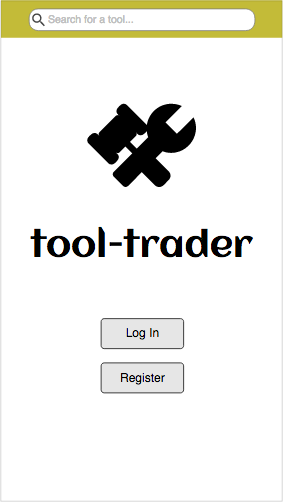
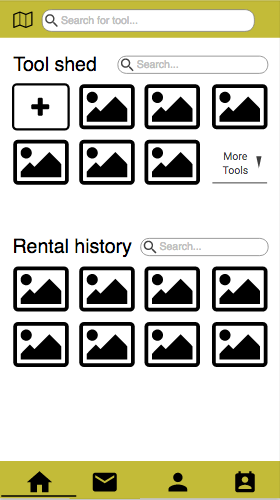
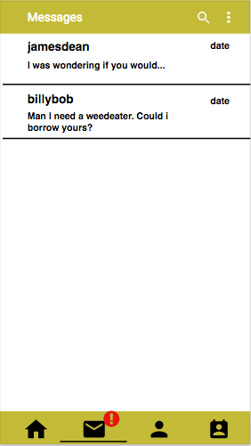
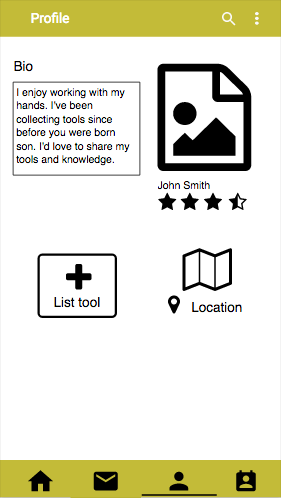
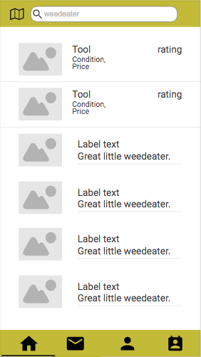
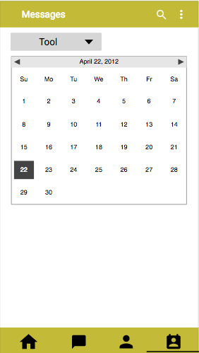

# tool-trader

## The overview

Tool-trader is a mobile app that allows you to borrow or rent tools from friends and locals, rather than buying a tool you may only use once. Maybe, you need a special tool to get the job done. Maybe, you hate having tools cluttering your garage. Or maybe, you have a bunch of spare tools lying around gathering dust and you want to make some spare cash. Either way, tool-trader is for you.

## The tech

## The mockup

 
[moqups](https://app.moqups.com/joellegg/wQNH7hWKnS/view)

## The queue
[github project](https://github.com/joellegg/tool-trader-ionic/projects/1)

## The project
[github repo](https://github.com/joellegg/tool-trader-ionic)
